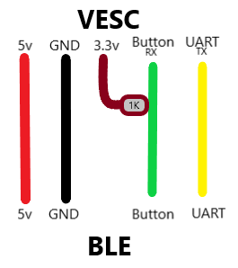

# G30 VESC Dashboard – Original + Race Profil

Lisp-Script, mit dem ein **Ninebot G30 Display** an einem VESC-Controller läuft –
erweitert um ein zweites, umschaltbares **Race-Profil** neben dem normalen
**Original-Profil**.

Getestet mit VESC 7.00 auf einem Spintend Ubox Single 85 200 mit 72V-Akku.

> **Welche Datei nehme ich?**
> Im Ordner [`VESC_Scripts`](VESC_Scripts) liegt immer die **neueste Alpha** –
> also die Version, die getestet ist und läuft. Einfach die nehmen.

## Installation

1. VESC Tool öffnen und per USB, Bluetooth oder WLAN mit dem VESC verbinden.
2. Script holen: [`VESC_Scripts/g30_dashboard_race.lisp`](VESC_Scripts/g30_dashboard_race.lisp)
   öffnen → oben rechts auf **Raw** → alles markieren und kopieren (Strg+A, Strg+C).
3. In VESC Tool auf **VESC Dev Tools → Lisp** gehen, den vorhandenen Inhalt
   löschen und den kopierten Code einfügen.
4. Auf **Upload** klicken. Mit **Stream** kann man es vorher testen, ohne es
   dauerhaft zu speichern.
5. Die ADC-App einrichten (siehe unten) – ohne das kommt kein Gas am Motor an.

## Verkabelung

Rot auf **5V** \
Schwarz auf **GND** \
Gelb auf **TX (UART-HDX)** \
Grün auf **RX (Button)** \
**1 kOhm Widerstand** von 3.3V auf
RX (Button)

Die Farben gelten für das originale Ninebot-Kabel. Aftermarket-Kabel haben oft
andere Farben – dann lieber nach Pin-Belegung gehen.

**Tipp:** Bei Störungen auf der Button-Leitung (Licht geht beim Bremsen von
selbst an o.ä.) helfen Kondensatoren auf 3.3V+GND und 5V+GND. Die Button-Leitung
teilt sich physisch die Leitung mit der UART-Kommunikation, und hartes Bremsen
zieht viel Strom durch denselben Kabelbaum.

## ADC Setup

Gas und Bremse laufen über die ADC-App, die muss einmal eingerichtet werden:

- **App Settings → General**: **APP to Use** auf `ADC`, dann **Write**
- **App Settings → ADC → General**: **Control Type** `Current`,
  **Use Filter** `True`, **Safe Start** `Regular`, **Update Rate** `1000 Hz`
- **App Settings → ADC → Mapping**: **ADC Mapping** öffnen, Gas und Bremse
  einmal komplett durchziehen, dann **Apply and Write**

Im Script steht `software-adc` standardmäßig auf `1`: Gas und Bremse kommen
dann über UART vom Display. Auf `0` stellen, wenn sie stattdessen direkt an den
ADC-Pins des VESC hängen.

> **Wichtig:** Akkuspannung und Abschaltgrenzen stellt das Script **nicht** ein –
> das machst du separat in der Motor-/Akku-Konfiguration im VESC Tool.

## Bedienung am Display

Alle Knopf-Gesten funktionieren nur im **Stillstand** (Sicherheitssperre).

| Geste | Funktion |
|---|---|
| 1x drücken (aus) | Roller einschalten |
| 1x drücken (an) | Licht an/aus |
| 2x drücken | Fahrmodus wechseln: Eco → Drive → Sport |
| 2x drücken + **Bremse** halten | Sperre (Wegfahrsperre) an/aus |
| 2x drücken + **Bremse und Gas** halten | **Original ↔ Race** umschalten (2x Piep) |
| Lang drücken (6 s) | Roller ausschalten |

Beim Aus- und Einschalten springt er automatisch zurück auf **Original** – Race
musst du nach jedem Neustart neu aktivieren.

## Einstellungen

Alle Werte, die man im Alltag ändern will, stehen als Tabelle **ganz oben im
Script** unter `QUICK-EDIT PARAMETERS`:

- Pro Fahrmodus (Eco/Drive/Sport, jeweils für Original und Race):
  Geschwindigkeit, Stromskalierung, Watt-Limit und Field Weakening.
- Temperatur-Warnschwellen für Motor und Controller.
- ADC-Schwellen für die Knopf-Gesten.
- `speed-limit-start`: wie früh der Geschwindigkeits-Regler anfängt, den Strom
  zurückzunehmen (gegen Geräusche am Limit).

Alles unterhalb von `Code starts here` ist Programmlogik und muss für normales
Tuning nicht angefasst werden.

## Features

- [x] Zwei komplette Profile (Original + Race), per Knopfdruck umschaltbar
- [x] Alle Tuning-Werte als Tabelle oben im Script
- [x] Fahrmodus-Wechsel Eco/Drive/Sport per Doppelklick
- [x] Wegfahrsperre (reine Gassperre, ohne Alarmanlage)
- [x] Ausschalten per langem Knopfdruck
- [x] Temperatur-Warnsymbol (Schwelle einstellbar)
- [x] Fehlercodes als echte Ninebot-G30-Codes statt VESC-interner Nummern
- [x] Entstörtes Knopf-Einlesen (3-fach-Mehrheitsentscheid)
- [ ] Frei konfigurierbare Anzeige (Stand/Fahrt, pro Profil) – in
      [Beta 3.0](https://github.com/ShrillingFly/Lejipy-g30-vesc-lisb-scribt/blob/beta-3.0/VESC_Scripts/g30_dashboard_race.lisp),
      noch nicht auf der Straße getestet

## Voraussetzungen

VESC-Firmware **7.00**, erhältlich auf https://vesc-project.com/

## Getestete Hardware

- Spintend Ubox Single 85 200, 72V-Akku
- Originales Ninebot G30 Display

## Versionen

Die komplette Historie von Alpha 1.0 bis heute steht im
[CHANGELOG.md](CHANGELOG.md) – jede Version verlinkt, mit dem was neu ist und
was behoben wurde. Jede Version liegt außerdem als eigener Branch im Repo.

## Credits

Basiert auf dem **G30 dashboard support lisp script** von
[AKA13](https://github.com/aka13-404) und [1zuna](https://github.com/1zun4) –
Originalprojekt: https://github.com/1zun4/vesc_scooter_support

Das Verkabelungsbild stammt aus deren Guide. Die Idee, das Fehlercode-Feld als
rot blinkende Anzeige zu nutzen (in Beta 3.0), stammt aus
[Sharkboys G30-Script](https://github.com/Sharkboy-j/vesc_g30_dash).

Weitere Anleitungen:
[DE-Guide von 1zuna](https://github.com/1zun4/vesc_scooter_support/blob/main/guide/DE.md) |
[Rollerplausch-Guide](https://rollerplausch.com/threads/vesc-controller-einbau-1s-pro2-g30.6032/)

## Lizenz

[GPL-3.0](LICENSE) – wie das Originalprojekt, von dem dieses Script abstammt.

## Haftungsausschluss

Privates Hobbyprojekt für einen eigenen E-Scooter. Änderungen an
Geschwindigkeit, Leistung und Strom vorsichtig testen und die örtlichen Gesetze
beachten. Keine Garantie, Benutzung auf eigene Gefahr.
